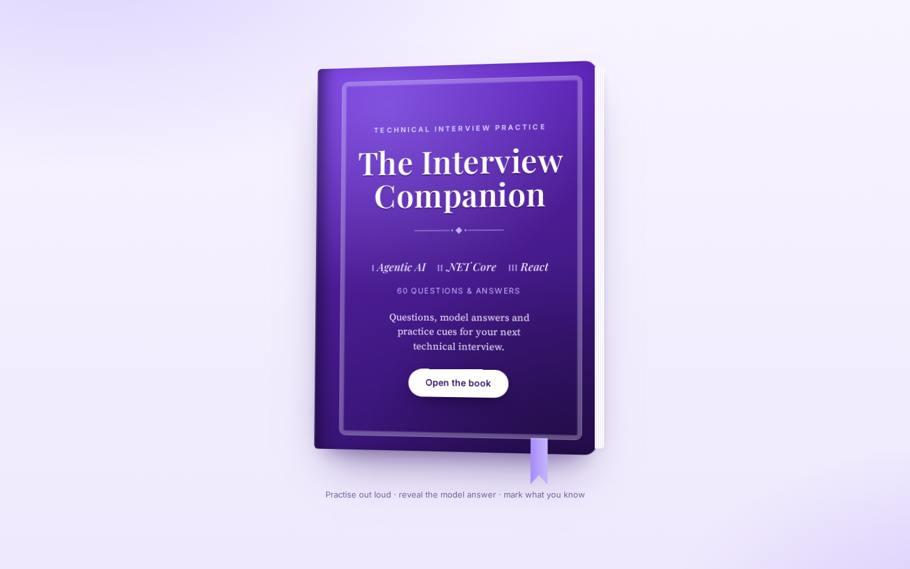
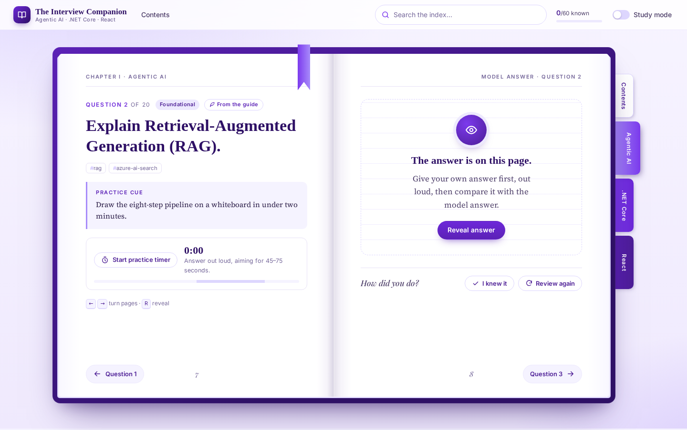

To run it locally, start the API with 
dotnet run --project src/InterviewPrep.Api
,then run 
npm install && npm run dev 
in 
src/interview-prep-web 
and open 
http://localhost:5173

# The Interview Companion

An interview-preparation app designed like a book in shades of purple and white. It is based on the *Technical Interview Practice: Claude Code · Agentic AI · .NET · Azure* guide and has three chapters with **20 questions and model answers each**:

| Chapter | Topic | Covers |
| --- | --- | --- |
| I | **Agentic AI** | LLM apps vs agents, RAG and agentic RAG, tool calling, MCP, Claude-assisted development, agentic SDLC, prompt injection, hallucinations, evaluation, LLMOps, Microsoft Foundry, scenarios |
| II | **.NET Core** | Exposing AI through ASP.NET Core, DI, middleware, Minimal APIs, async/cancellation, options, Entra ID auth, managed identity, EF Core, resilience, observability, testing, Azure deployment |
| III | **React** | Rendering, hooks, state, keys, forms, context, performance, React 19, Server Components, Suspense, error boundaries, routing, streaming AI responses, MSAL, testing, accessibility |

The 20 model answers from the guide are spread across the chapters and marked **From the guide**. The other answers were written to match the guide's style.

| Cover | Question spread |
| --- | --- |
|  |  |

## Features

- **Book design.** A purple cover opens onto a two-page spread: the question on the left page and the model answer on the right. Pages turn with an animation, and chapter bookmarks hang off the edge. On phones the spread becomes a single column.
- **Practice first, then reveal.** Each answer stays hidden until you reveal it (button or <kbd>R</kbd>). A practice timer marks the guide's 45–75 second target.
- **Self-rating.** You mark each question *I knew it* or *Review again*. Each chapter shows its progress and can be filtered to *To review* or *Not started*. Progress is kept in the browser's localStorage.
- **Study mode** shows every answer straight away, for reading through.
- **Index search** covers questions, answers, key points and tags.
- **Keyboard navigation:** <kbd>←</kbd> <kbd>→</kbd> turn pages.

## Architecture

```
Browser ── React 19 SPA (Vite, TypeScript, React Router)
   │          served from wwwroot of ↓  (same origin, no CORS)
   ▼
Azure App Service (Linux) ── ASP.NET Core 10 Minimal API
   │   /api/categories, /api/categories/{slug}, /api/categories/{slug}/questions/{n}, /api/search, /health
   │   IQuestionBank → JsonQuestionBank (embedded Data/questions.json)
   ▼
Application Insights + Log Analytics (OpenTelemetry via Azure Monitor distro)
```

- **API** (`src/InterviewPrep.Api`): .NET 10 Minimal API with `TypedResults`, ProblemDetails, output caching, health checks and OpenAPI (`/openapi/v1.json` in Development). The question bank sits behind `IQuestionBank`, so the embedded JSON can be replaced with Cosmos DB or Azure SQL without changing the endpoints.
- **Web** (`src/interview-prep-web`): React 19, TypeScript and Vite. Data loads with React 19 `use()` and Suspense, with error boundaries around each spread.
- **Single deployment:** `dotnet publish` runs `npm ci && npm run build` and ships the React build in `wwwroot`. `MapFallbackToFile("index.html")` handles client-side routes, and unknown `/api/*` routes return a real 404.
- **Infrastructure** (`infra/`): Bicep for the resource group, Log Analytics, Application Insights, a Linux App Service plan and the Web App (.NET 10, HTTPS only, TLS 1.2, FTPS disabled, `/health` health check, system-assigned managed identity).

## Run locally

Prerequisites: [.NET 10 SDK](https://dotnet.microsoft.com/download) and Node.js 20+.

```bash
# Terminal 1: API on http://localhost:5057
dotnet run --project src/InterviewPrep.Api --launch-profile http

# Terminal 2: React dev server on http://localhost:5173 (proxies /api to the API)
cd src/interview-prep-web
npm install
npm run dev
```

Open http://localhost:5173.

To run the production build the way Azure does:

```bash
dotnet publish src/InterviewPrep.Api -c Release -o ./publish
cd publish && ASPNETCORE_URLS=http://localhost:8080 dotnet InterviewPrep.Api.dll
```

## Tests

```bash
dotnet test                                    # API: question bank + endpoint integration tests (WebApplicationFactory)
cd src/interview-prep-web && npm test          # UI: Vitest + React Testing Library
cd src/interview-prep-web && npm run typecheck
```

## Deploy to Azure

### Option A: Azure Developer CLI (quickest)

```bash
azd auth login
azd up        # prompts for environment name, subscription and region, then provisions and deploys
```

`azd up` provisions `infra/main.bicep` and deploys the `web` service defined in `azure.yaml`.

### Option B: GitHub Actions

`.github/workflows/ci-cd.yml` builds and tests on every push and pull request. On pushes to `main` it also deploys to App Service using OpenID Connect, so no Azure secrets are stored in GitHub.

1. Provision the infrastructure once, with `azd provision` or:
   ```bash
   az deployment sub create -l <region> -f infra/main.bicep \
     -p environmentName=interview-prep location=<region>
   ```
2. Create a Microsoft Entra app registration (or user-assigned identity) with a federated credential for this repo's `production` environment, and give it the **Website Contributor** role on the web app.
3. Add these repository **variables**: `AZURE_CLIENT_ID`, `AZURE_TENANT_ID`, `AZURE_SUBSCRIPTION_ID`, `AZURE_WEBAPP_NAME` (the `AZURE_WEBAPP_NAME` output of the deployment).

## Editing the questions

All content is in [`src/InterviewPrep.Api/Data/questions.json`](src/InterviewPrep.Api/Data/questions.json). Each question has `question`, `answer`, an optional `code` sample, 3–5 `keyPoints`, a `practiceCue`, a `difficulty` (`Foundational` | `Intermediate` | `Advanced`), `tags` and `fromGuide`. The API tests check that every chapter has questions numbered 1–20 and that every answer is complete.

## Project layout

```
InterviewPrep.slnx
src/
  InterviewPrep.Api/          ASP.NET Core 10 API (+ React build in wwwroot on publish)
    Data/questions.json       the 60 questions & answers
    Endpoints/ Models/ Services/
  interview-prep-web/         React 19 + Vite + TypeScript book UI
    src/components/           Book, Page, Bookmarks, TopBar, timer, badges
    src/pages/                Cover, Contents, Chapter, Question, Search
tests/InterviewPrep.Api.Tests xUnit tests
infra/                        Bicep (subscription scope → resource group → resources)
azure.yaml                    Azure Developer CLI service definition
.github/workflows/ci-cd.yml   build, test, deploy
```
